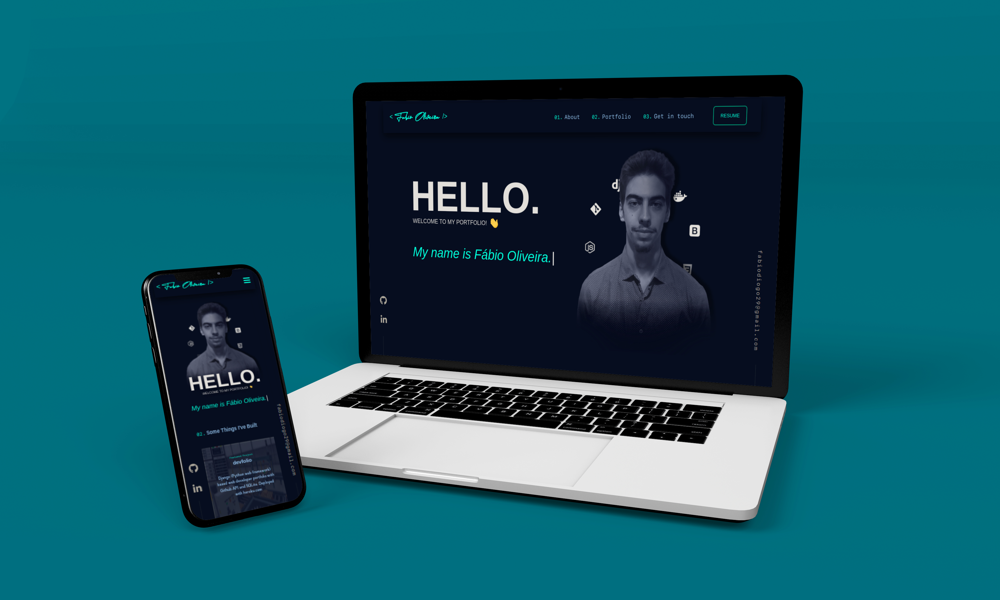

<h2 align="center">Personal DevFolio (Developer Portfolio)</h2>
  
 
<br>
<br>

### <b>Using it</b> <i>(DEBUG set to False)</i>

- With this template you'll be able to check your GitHub projects in real time

- You'll be able to add images to your projects(Featured) through the admin panel

- You'll receive an email from every one who reaches you through the contact form on the website

<br>

For everything to work properly you need to change the `.env` file according to your data and create a `admin_login` through django:

```python
# .env file you need to change

SECRET_KEY=YOUR-SECRET-KEY-HERE # from settings.py

EMAIL=user@gmail.com            # valid email
PASSWORD=password               # valid password

GITHUB_USER=github_user         # github user id

TARGET=receiver@gmail.com       # your email

DJANGO_DEBUG=False              # debug
```

Fix SMTP Authentication Error

```
(1) Login to gmail in your browser >> (2) Navigate to the DisplayUnclockCaptcha page. >>> (3) Click the continue button, and you will see the message 'Account access enabled Please try signing in to your Google account again from your new device or application.' >>> (4) Run your Python script - your login attempt should be successful.

Source: https://stackoverflow.com/a/56497703
```

```python
# create a admin login in terminal

python manage.py migrate
python manage.py createsuperuser
```

<br>

### <b>Testing</b> <i>(DEBUG set to True)</i>

Your website will auto update for every `CTRL+S` in vs code

```
pip install -r requirements     # install packages
python manage.py livereload     # start server with auto-reload

python manage.py runserver      # start django web app
```

### Deployed with heroku.com and Github Actions.
